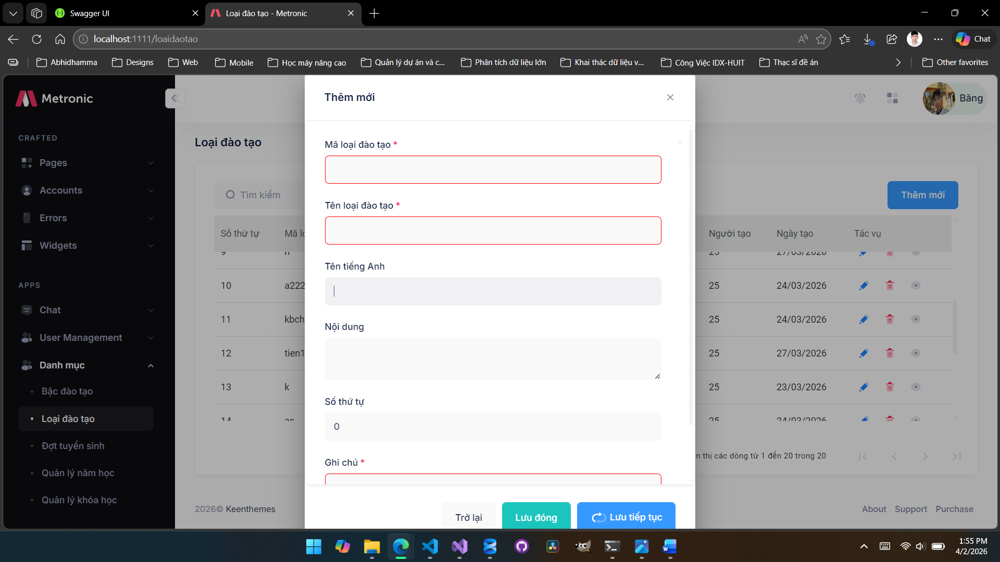
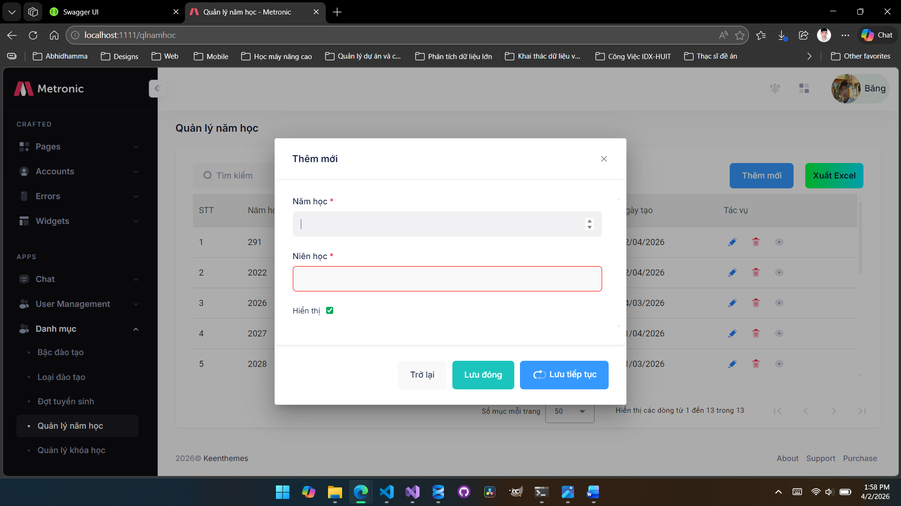
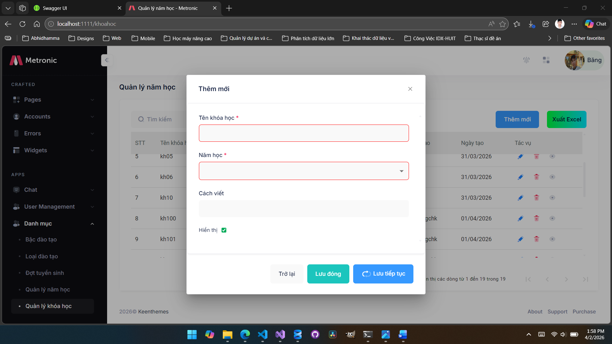
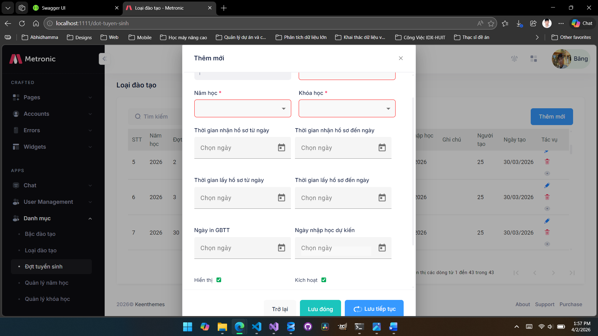

<h2 align="center">🛠 Đây là phần code để làm quen với dự án tại Viện chuyển đổi số - IDX - HUIT🛠</h2>
<h6 align="center">⚔  Công nghệ sử dụng: ASP.NET Core API, SqlServer Database, Angular ⚔ </h6>

<h3 align="left">1. Chức năng quản lý Loại đào tạo</h3>
<h4 align="left">🖋 Chức năng bao gòm thêm mới, cập nhật, sửa và xóa và các ràng buột dữ liệu liên quan</h4>
<h1 border-radius="10px" align="center"></h1>

<h3 align="left">1. Chức năng quản lý Năm học</h3>
<h4 align="left">🖋 Chức năng bao gòm thêm mới, cập nhật, sửa và xóa và các ràng buột dữ liệu liên quan. Ngoài ra còn có chức năng xuất excel những thông tin trên bảng hiển thị</h4>
<h1 border-radius="10px" align="center"></h1>        

<h3 align="left">1. Chức năng quản lý Khóa học</h3>
<h4 align="left">🖋 Chức năng bao gòm thêm mới, cập nhật, sửa và xóa và các ràng buột dữ liệu liên quan. Bên cạnh đó còn có chức năng xuất excel những thông tin trên bảng hiển thị</h4>
<h1 border-radius="10px" align="center"></h1>
        
<h3 align="left">1. Chức năng quản lý Đợt tuyển sinh</h3>
<h4 align="left">🖋 Chức năng bao gòm thêm mới, cập nhật, sửa và xóa và các ràng buột dữ liệu liên quan</h4>
<h1 border-radius="10px" align="center"></h1>
        
<h4 align="left">Đây là phần code để làm quen với dự án tại IDX</h4>
<h5 align="left">Thời gian thực hiện trải dài từ ngày 16/3 - 2/4 năm 2026</h5>

<h5 align="left">###Người thực hiện: Cao Hoàng Khánh Băng - Thiện Minh Chánh</h5> 

[alt text](image.png)kênh youtube của tôi: <a href="https://www.youtube.com/@khanhbangcaohoang">https://www.youtube.com/@khanhbangcaohoang</a>
<h6 align="right">📜 Cảm ơn người hướng dẫn! và các anh chị bạn bè thuộc viện! 📜</h6>